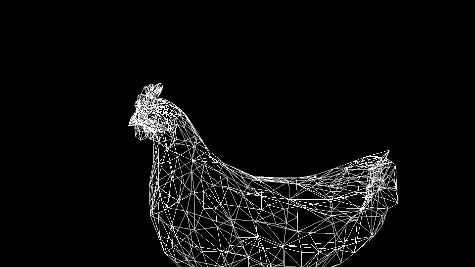
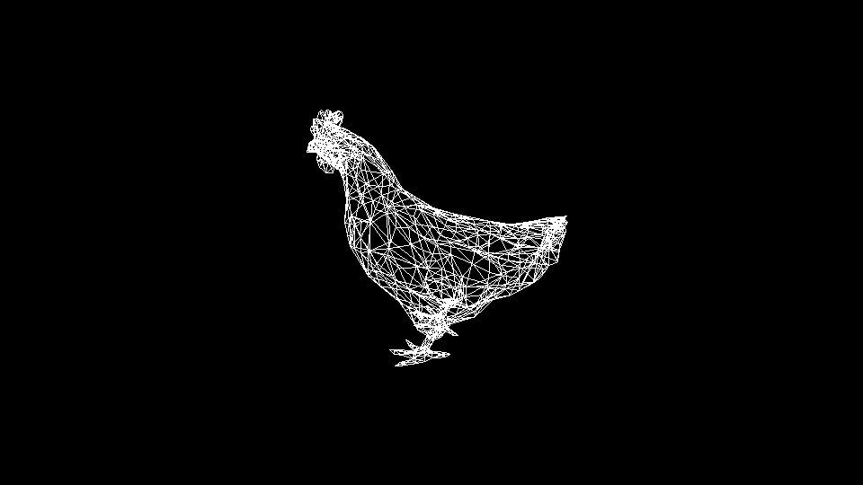
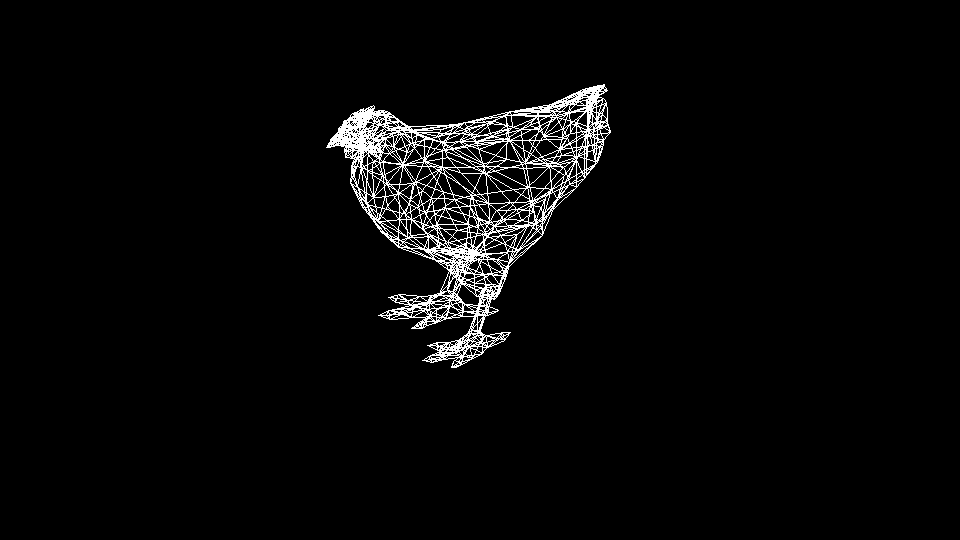
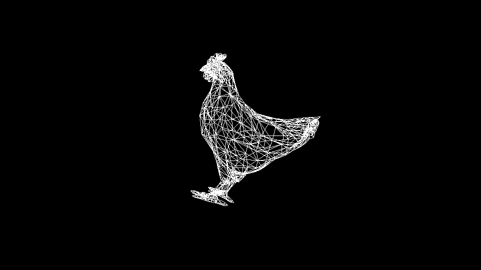
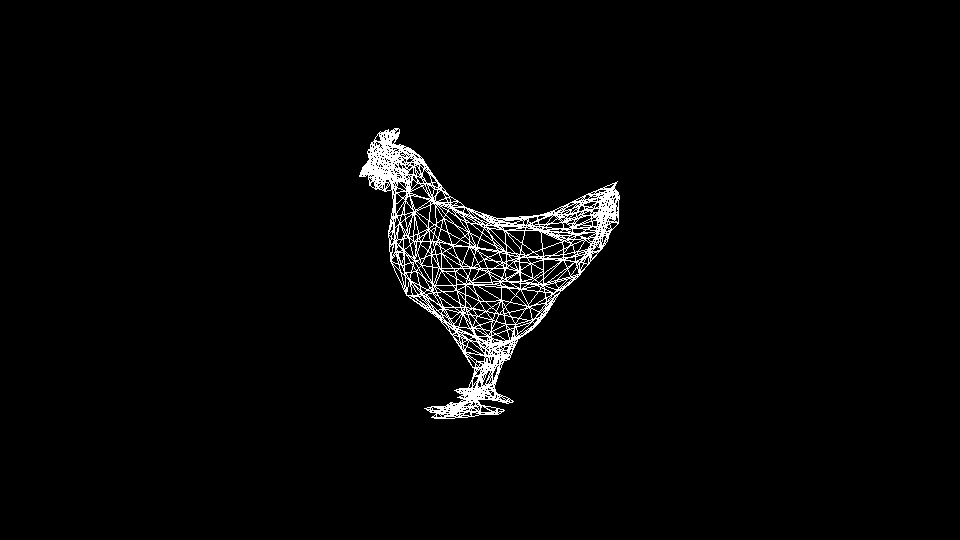

# rasterizer
 
# Photoshoot!
- Medium shot 
    Presionar la tecla [a]

    

- Low angle
    Presionar la tecla [b]

    
    
- High angle
    Presionar la tecla [c]

    
    
- Dutch angle
    Presionar la tecla [d]

    

- Reset camara
    Presionar la tecla [r]

    